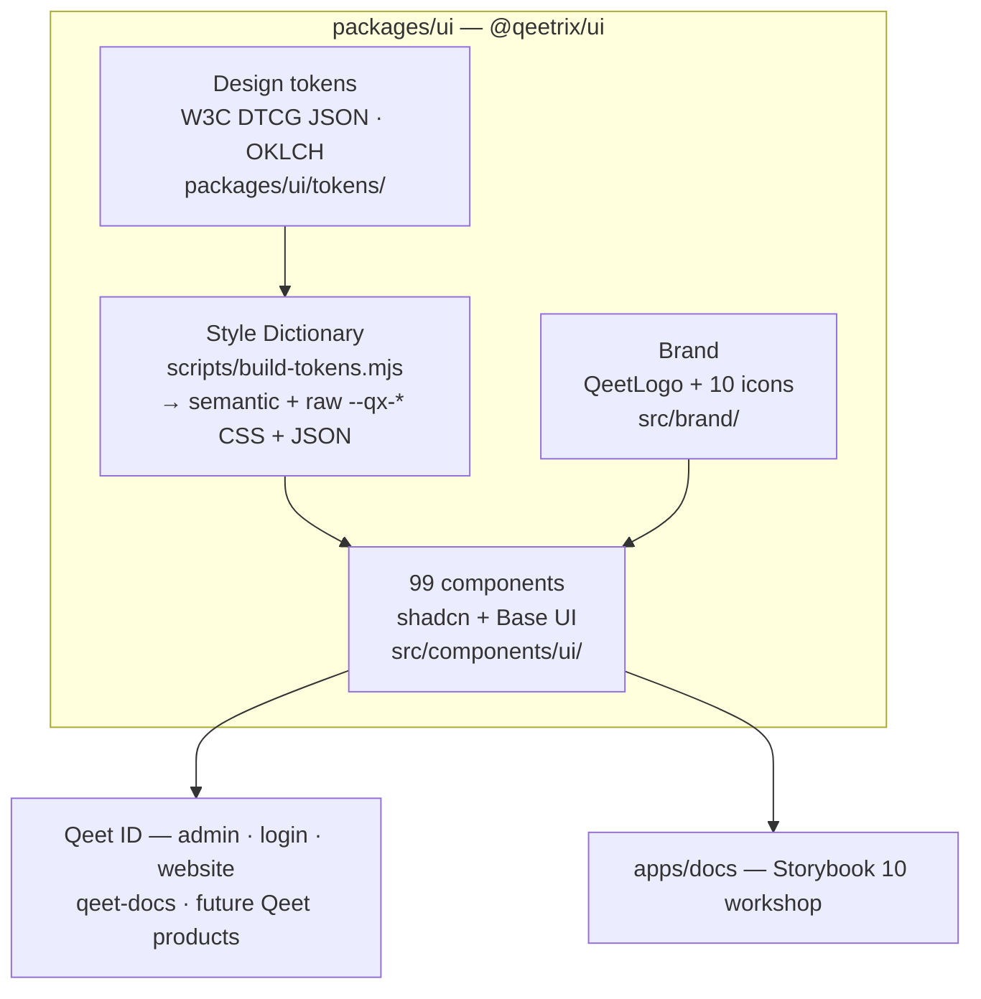

<div align="center">

# 🎨 Qeetrix

### The Qeet Group design system — one package, every surface

*Premium · Accessible · Token-driven · Built on Base UI + Tailwind v4*

<br>

[](./.github/workflows/ci.yml)
[](https://react.dev)
[](https://tailwindcss.com)
[](https://base-ui.com)
[](https://storybook.js.org)
[](https://pnpm.io)

**[🚀 Install](#-install--use)** · **[🏗 Architecture](#-architecture)** · **[🧩 Components](#-whats-inside)** · **[🎨 Tokens](#-design-tokens)** · **[📖 Storybook](#-develop)** · **[🚢 Release](#-release)**

</div>

---

<div align="center">

| 🧩 99 components | 📦 1 install | 🎨 WCAG-AA tokens | 🌗 Light + dark | ⚛️ React 19 |
|:---:|:---:|:---:|:---:|:---:|
| shadcn + Base UI | `@qeetrix/ui` | OKLCH · Style Dictionary | `.dark` class | Tailwind v4 |

</div>

> **Status — pre-1.0 (next publish: `@qeetrix/ui@0.4.0`).** Tokens + brand are now folded into a single `@qeetrix/ui` package; the component set, premium-elevation pass, and Cal Sans typography are in. Already a live dependency of **Qeet ID** (admin · login · website) and **qeet-docs**.

---

## ✨ Why Qeetrix

|  |  |
|:--|:--|
| 📦 **One install, everything in it** | `@qeetrix/ui` ships components **+ design tokens + brand** — no peer packages to wire up |
| ♿ **Accessible by construction** | Built on **Base UI** (WAI-ARIA APG behavior) + axe-tested stories; visible focus, reduced-motion, AA contrast |
| 🎨 **Token-driven theming** | W3C DTCG JSON → Style Dictionary → CSS + JSON; OKLCH colour, light/dark via the `.dark` class |
| 💎 **Premium by default** | Layered elevation, refined focus rings, tasteful hover-lift micro-interactions, self-hosted Cal Sans |
| 🌗 **First-class dark mode** | Every component themed through semantic tokens — no hard-coded greys |
| 🏢 **Enterprise breadth** | Data tables, command palette, rich-text editor, charts, sidebar shells, date/time pickers, and more |
| 🧱 **Consistent foundation** | Shared `cva` + `cn()` conventions, `data-slot` hooks, tree-shakeable named exports |
| 🔒 **Quality-gated** | Typecheck + ESLint + Vitest/axe + WCAG contrast + Storybook build run in CI on every PR |

---

## 🏗 Architecture

A **pnpm + Turborepo** monorepo that publishes a single consumable package. Tokens are the source of truth; everything downstream is generated or composed from them.



**Build pipeline (`@qeetrix/ui`):** `build-tokens` (Style Dictionary) → `tsc` → `tsc-alias` → `postbuild` (inlines the token CSS, copies fonts). The shared `pnpm-workspace.yaml` **catalog** pins React / Tailwind / TS across the repo.

### Packages

| Package | What it is | Published |
|:--|:--|:--:|
| **`@qeetrix/ui`** | The component library **+ tokens + brand** — the one package consumers install | ✅ |
| `@qeetrix/tsconfig` | Shared TypeScript presets | ✅ |
| `@qeetrix/eslint-config` | Shared ESLint flat config (base + React) | ✅ |
| `apps/docs` | Storybook 10 workshop — foundations + a story per component | private |

> `@qeetrix/tokens` and `@qeetrix/brand` were once separate packages; they're now **folded into `@qeetrix/ui`** and exposed as subpaths (`@qeetrix/ui/tokens.css`, `/tokens.json`, `/qeetrix.css`, `/brand`).

---

## 🚀 Install & use

```bash
pnpm add @qeetrix/ui        # components + tokens + brand, all in one
pnpm add react react-dom    # peers (>= 19)
```

In your Tailwind v4 global stylesheet:

```css
@import "@qeetrix/ui/styles.css";              /* tokens + fonts + base layer */
@source "../node_modules/@qeetrix/ui/dist/**/*.js";   /* let Tailwind see component classes */
```

Then wrap the app and compose:

```tsx
import { ThemeProvider, Button, Card, CardContent } from "@qeetrix/ui";
import { QeetLogo } from "@qeetrix/ui/brand";

export function App() {
  return (
    <ThemeProvider defaultTheme="system">
      <Card>
        <CardContent className="flex items-center gap-3">
          <QeetLogo size={28} />
          <Button>Authenticate with Qeet</Button>
        </CardContent>
      </Card>
    </ThemeProvider>
  );
}
```

Light/dark is driven by the `.dark` class (managed by `ThemeProvider`). Need raw values? `@qeetrix/ui/tokens.css` (the `--qx-*` ramp) and `@qeetrix/ui/tokens.json`.

**Import surfaces:** barrel `@qeetrix/ui` · per-component `@qeetrix/ui/components/ui/button` · brand `@qeetrix/ui/brand` · utils `@qeetrix/ui/lib/utils` · hooks `@qeetrix/ui/hooks/*`.

---

## 🧩 What's inside

> 99 React components across the full enterprise surface — every one with a Storybook story; interactive ones with Vitest + axe tests.

- **Overlays** — Dialog · Sheet · Drawer · Popover · DropdownMenu · ContextMenu · Menubar · HoverCard · Tooltip · CommandPalette · NavigationMenu
- **Inputs & controls** — Button · Input · Textarea · Select · Combobox · MultiSelect · Autocomplete · Checkbox · Radio · Switch · Toggle · Slider · AngleSlider · OTPInput · NumberField · Field / Form · Chip · SegmentedControl · ColorPicker · Date / Time / Timezone pickers
- **Data & navigation** — Table · DataTable · Tabs · Breadcrumb · Pagination · Sidebar · Tree · Timeline · Accordion · Collapsible · Listbox · TableOfContents · Carousel · Charts
- **Feedback & surfaces** — Card · Alert · Banner · Notification · Toast · Stat · Badge · StatusPill · Skeleton · Progress · Meter · EmptyState · Feed · Spoiler · Marquee
- **Content & typography** — Typography / Prose · Blockquote · Highlight · Kbd · CodeBlock · JSONTree · RichTextEditor · NumberFormatter · RollingNumber
- **Brand** — `QeetLogo` (theme-adaptive) + 10 custom Qeet icons, at `@qeetrix/ui/brand`
- **Blocks** — auth, dashboard shell, settings layout, onboarding wizard, pricing table

---

## 🎨 Design tokens

The single source of truth lives in [`packages/ui/tokens/`](packages/ui/tokens/) as **W3C DTCG JSON** (primitives → light/dark semantic + shadcn bridge). [Style Dictionary](packages/ui/scripts/build-tokens.mjs) compiles them to:

- `@qeetrix/ui/styles.css` — the full entry (semantic `:root` / `.dark` vars, baked in)
- `@qeetrix/ui/tokens.css` — the raw `--qx-*` ramp · `@qeetrix/ui/tokens.json` — resolved per theme
- `@qeetrix/ui/qeetrix.css` — semantic layer only

Colour is authored in **OKLCH**; elevation uses a **layered shadow ladder** (rest · hover · popover · modal). Every semantic text/surface pair is held to **WCAG-AA contrast** by a build gate (`pnpm tokens:validate`).

> The brand palette (`OD-DS-03`) is a documented open decision — tokens stay neutral until it lands; the Qeet orange (`#F26D0E`) is the leading candidate.

---

## 🛠 Develop

**Toolchain:** Node ≥ 20.9 (`nvm use node`) · **pnpm@10.32.1** (Corepack) · Turborepo.

```bash
pnpm install
pnpm build            # turbo run build (@qeetrix/ui regenerates tokens, then compiles)
pnpm tokens:build     # regenerate only the design tokens (Style Dictionary)
pnpm tokens:validate  # WCAG-AA contrast gate on the generated semantic pairs
pnpm lint typecheck
pnpm --filter @qeetrix/ui test           # Vitest + vitest-axe
pnpm --filter @qeetrix/docs storybook    # component workshop on :6006
```

Adding a component? Drop it in [`packages/ui/src/components/ui/`](packages/ui/src/components/ui/) (one flat file, `cva` + `cn()`, `data-slot`, Base UI for anything interactive), export it from `src/index.ts`, add a story + a Vitest/axe test, and record a changeset. The competitive backlog lives in [`qeet-files/qeetrix/COMPONENT-PROPOSALS.md`](../qeet-files/qeetrix/COMPONENT-PROPOSALS.md); the delivery pipeline + agents in [`.claude/PIPELINE.md`](.claude/PIPELINE.md). See [CONTRIBUTING.md](./CONTRIBUTING.md).

---

## 🚢 Release

Versioning + npm publishing run on [Changesets](.changeset/README.md):

```bash
pnpm changeset          # record a change (pick packages + bump)
pnpm version-packages   # apply bumps + changelogs (usually CI)
pnpm release            # build all, then publish changed public packages
```

CI runs lint + typecheck + build + token contrast + Storybook on every PR; merging the **Version Packages** PR publishes to the `@qeetrix` npm org (needs `NPM_TOKEN`).

---

## 📚 Documentation · 🤝 Contributing · 📄 License

| Topic | Where |
|:--|:--|
| 🧱 Component workshop | `pnpm --filter @qeetrix/docs storybook` → <http://localhost:6006> |
| 🤖 For AI assistants | [CLAUDE.md](./CLAUDE.md) — commands, architecture, gotchas |
| 🗺 Component backlog | [qeet-files/qeetrix/COMPONENT-PROPOSALS.md](../qeet-files/qeetrix/COMPONENT-PROPOSALS.md) |
| 🔧 Contributing | [CONTRIBUTING.md](./CONTRIBUTING.md) |

Part of the **Qeet Group** workspace alongside [Qeet ID](../qeet-id/). Licensed **UNLICENSED** (private to Qeet Group) pending the public-release decision.
